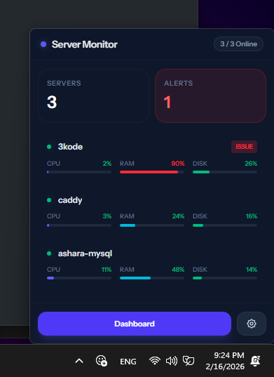
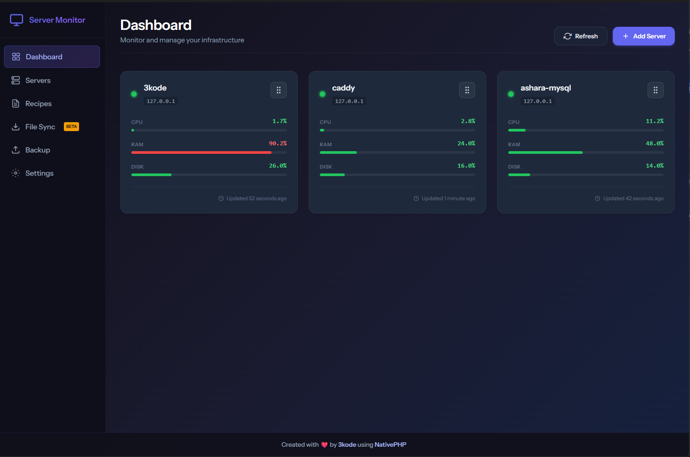
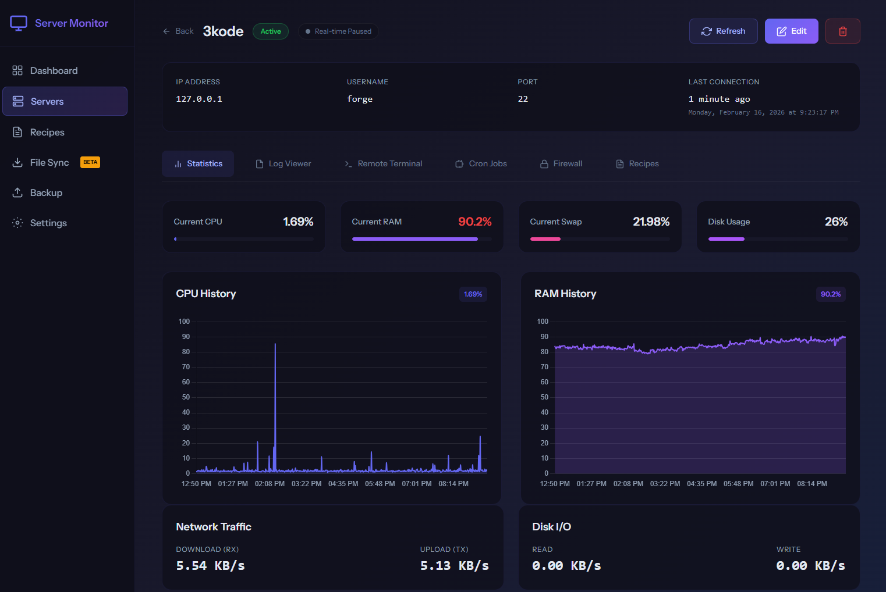

# Server Monitor

A comprehensive desktop application for monitoring and managing remote servers through SSH connections. Built with Laravel 12, Inertia.js, Vue 3, and NativePHP for a native desktop experience.






## 🚀 Features

### Server Management
- **SSH Connection Management**: Securely connect to servers using password or SSH key authentication
- **Server Discovery**: Automatically detect and manage multiple servers
- **Connection Testing**: Validate SSH connections before adding servers
- **Server Status Monitoring**: Track connection status and last activity

### Real-Time Monitoring
- **System Metrics**: Monitor CPU, RAM, Disk usage, and Swap memory in real-time
- **Network Statistics**: Track network I/O (RX/TX) and disk I/O operations
- **Load Averages**: Monitor 1, 5, and 15-minute load averages
- **Process Monitoring**: View top processes and their resource usage
- **Live Streaming**: Real-time metric updates with streaming capabilities

### Service Management
- **Service Discovery**: Automatically detect installed services on servers
- **Service Control**: Start, stop, restart, and reload services
- **Status Monitoring**: Track service health and status

### Advanced Server Administration
- **Terminal Access**: Direct SSH terminal access to servers
- **Log Management**: View and download server logs
- **Firewall Management**: Configure UFW firewall rules, enable/disable firewall
- **Cron Job Management**: View and edit crontab entries with human-readable descriptions
- **Caddy Web Server**: Manage Caddyfile configurations for web serving

### Automation & Recipes
- **Recipe System**: Create and run automated scripts/recipes on servers
- **File Synchronization**: Sync files between local machine and servers
- **Scheduled Tasks**: Automated metric collection and monitoring

### Data Management
- **Backup & Restore**: Export and import application data
- **Settings Management**: Configure application preferences
- **Metric History**: Historical data storage and analysis

## 🛠️ Technology Stack

- **Backend**: Laravel 12 (PHP 8.4+)
- **Frontend**: Vue 3 with Inertia.js 2
- **Styling**: Tailwind CSS 4
- **Database**: SQLite (configurable)
- **SSH Library**: phpseclib
- **Desktop Framework**: NativePHP 2
- **Charts**: Chart.js with Vue-ChartJS
- **Terminal**: XTerm.js
- **Build Tool**: Vite with Wayfinder plugin
- **Testing**: Pest PHP

## 📋 Requirements

- PHP 8.2 or higher
- Composer
- Node.js 18+ and npm
- SSH access to target servers
- NativePHP desktop environment

## 🚀 Installation

1. **Clone the repository**:
   ```bash
   git clone https://github.com/samehdoush/serverMonitor.git
   cd serverMonitor
   ```

2. **Install PHP dependencies**:
   ```bash
   composer install
   ```

3. **Install Node.js dependencies**:
   ```bash
   npm install
   ```

4. **Environment Setup**:
   ```bash
   cp .env.example .env
   php artisan key:generate
   ```

5. **Database Setup**:
   ```bash
   php artisan migrate
   ```

6. **Build Assets**:
   ```bash
   npm run build
   ```

7. **Run the Application**:
   ```bash
   php artisan native:run
   ```

   Or for development with hot reload:
   ```bash
   npm run dev
   ```

## 🔧 Configuration

### Server Connection
Add servers through the web interface with the following details:
- Server name and IP address
- SSH port (default: 22)
- Authentication method (password or SSH key)
- Username and credentials
- Resource thresholds for alerts

### Environment Variables
Key configuration options in `.env`:
- `APP_NAME`: Application name
- `DB_CONNECTION`: Database connection (default: sqlite)
- `QUEUE_CONNECTION`: Queue driver for background jobs

## 📊 Usage

### Adding a Server
1. Navigate to the Servers section
2. Click "Add Server"
3. Enter server details and test connection
4. Configure monitoring thresholds
5. Save and start monitoring

### Monitoring Dashboard
- View real-time metrics for all servers
- Set up alerts for threshold breaches
- Access detailed server information
- Run automated recipes

### Advanced Features
- **Terminal**: Direct command execution on servers
- **Recipes**: Create reusable automation scripts
- **File Sync**: Bidirectional file synchronization
- **Backup**: Export application configuration and data

## 🤝 Contributing

We welcome contributions! Please follow these steps:

1. Fork the repository
2. Create a feature branch (`git checkout -b feature/amazing-feature`)
3. Commit your changes (`git commit -m 'Add amazing feature'`)
4. Push to the branch (`git push origin feature/amazing-feature`)
5. Open a Pull Request

### Development Guidelines
- Follow PSR-12 coding standards
- Use Laravel Pint for code formatting
- Update documentation as needed


## 📝 License

This project is licensed under the MIT License - see the [LICENSE](LICENSE) file for details.

## 🙏 Acknowledgments

- Built with [Laravel](https://laravel.com/)
- Powered by [Inertia.js](https://inertiajs.com/)
- Desktop app via [NativePHP](https://nativephp.com/)
- SSH connectivity with [phpseclib](https://phpseclib.com/)

## 📞 Support

If you encounter any issues or have questions:
- Open an issue on GitHub
- Check the documentation
- Join our community discussions

---

**Why Server Monitor?**

Server Monitor provides a unified, user-friendly interface for system administrators and developers to monitor and manage remote servers. Unlike traditional monitoring tools that require complex setups or web-based dashboards, Server Monitor offers:

- **Native Desktop Experience**: Runs as a native application on your desktop
- **Real-time Monitoring**: Live updates without page refreshes
- **Comprehensive Management**: From basic monitoring to advanced server administration
- **Security First**: Secure SSH connections with key-based authentication
- **Extensible**: Recipe system for custom automation
- **Cross-platform**: Works on Windows, macOS, and Linux

Perfect for DevOps engineers, system administrators, and developers managing infrastructure.</content>
<parameter name="filePath">c:\Users\sameh\Herd\serverMonitor\README.md